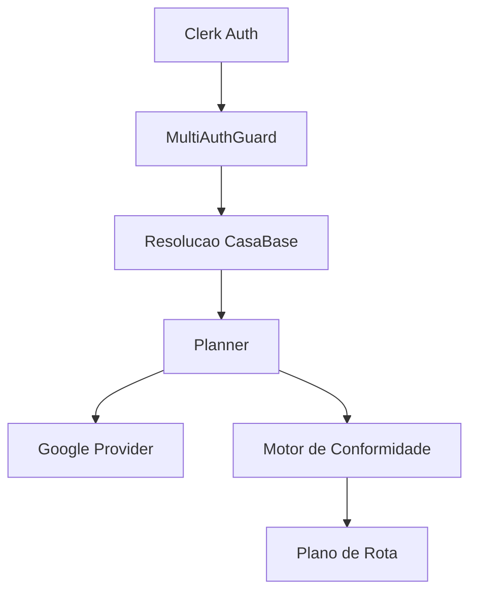
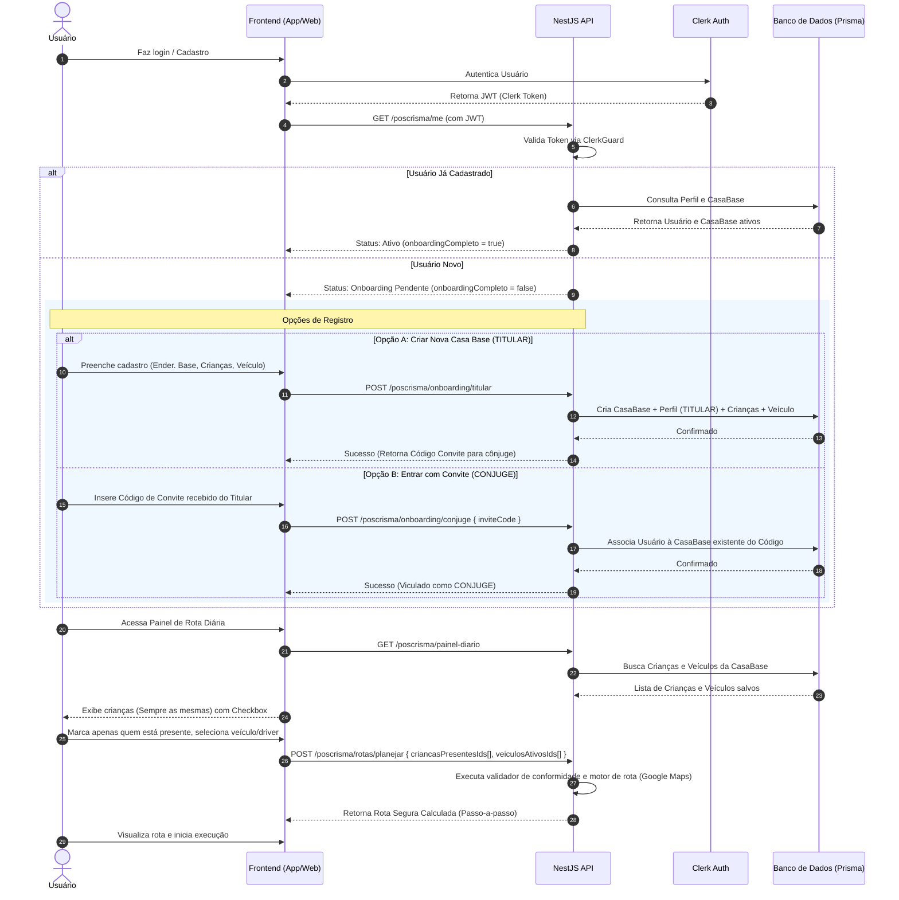

# Design Doc — Roteirização Segura (MVP Simplificado)

## Status
Draft

## Autor
Leonardo Nascimento Cintra

## Objetivo
O módulo de roteirização tem como objetivo organizar o transporte seguro de crianças/adolescentes da comunidade de volta para suas casas a partir de uma Casa Base.

A principal restrição do sistema é impedir qualquer trecho de rota onde exista apenas 1 adulto e 1 única criança/adolescente no veículo, reduzindo riscos operacionais e situações inadequadas.

O objetivo principal deste MVP é simplificar ao máximo o fluxo, utilizando login por casal (com compartilhamento de dados), cadastro fixo de crianças/endereços e uma abordagem direta de geração de rota via IA (ou ordenação simples) acoplada a um validador de segurança rígido no backend.

## Escopo Simplificado (MVP)
Para reduzir a complexidade e focar no que realmente importa, o escopo deste MVP foi simplificado para:

- **Autenticação e Compartilhamento (Login Casal)**: Autenticação via Clerk integrada ao contrato atual. Permite o vínculo de duas contas (TITULAR e CONJUGE) à mesma `CasaBase` usando um código de convite simples.
- **Cadastro Base (Tenant)**:
  - Cadastro da `CasaBase` (coordenada de origem e retorno).
  - Cadastro fixo de crianças/adolescentes (nome, endereço e coordenadas de destino). Serão sempre o mesmo grupo de crianças.
  - Cadastro de pelo menos 1 veículo e identificação de motorista/acompanhante na rota.
- **Roteirização Simplificada com IA + Validador Determinístico**:
  - Geração de rota chamando uma IA (ex: Google Gemini API) ou ordenação direta por proximidade geográfica para definir a sequência ideal das paradas.
  - **Validador de Segurança Rígido (Invariante no Backend)**: O backend simula a sequência de paradas sugerida pela IA e garante matematicamente que em nenhum trecho do trajeto restará exatamente **1 adulto e 1 criança** sozinhos no carro.
- **Execução Visual**: Geração de um link direto do Google Maps com os waypoints ordenados prontos para abrir no celular do condutor (`https://www.google.com/maps/dir/?api=1&origin=...&destination=...&waypoints=...`).

### Fora de Escopo do MVP
- Suporte a múltiplos carros simultâneos (limitado a 1 carro ativo por planejamento de rota).
- Algoritmos complexos de VRP (Vehicle Routing Problem) codificados do zero.
- Reorganização avançada de paradas simultâneas multifamiliares ou divisões geográficas complexas.
- Rastreamento em tempo real ou mapas interativos customizados complexos.

## Contexto de Negócio
O módulo de roteirização foi concebido para organizar o transporte seguro
de crianças e adolescentes entre famílias participantes de uma mesma comunidade.

Atualmente, o planejamento das rotas ocorre de forma manual, informal e sem
controle sistemático de segurança, gerando dificuldades como:

- distribuição ineficiente de passageiros;
- excesso de viagens desnecessárias;
- falta de controle de capacidade dos veículos;
- ausência de padronização na definição de responsáveis;
- dificuldade para coordenação entre famílias;
- risco operacional durante embarque e desembarque;
- ausência de rastreabilidade das decisões tomadas.

Além do problema operacional, existe uma exigência crítica de conformidade:
o sistema nunca pode permitir situações consideradas inadequadas ou inseguras
durante qualquer trecho da rota.

A principal regra de segurança do domínio é:

- nunca permitir que exista apenas 1 adulto e 1 única criança/adolescente
  sozinhos em um veículo durante qualquer trecho da rota.

Essa restrição deve ser tratada como uma invariante obrigatória do sistema,
não podendo ser ignorada pelo algoritmo, usuário ou interface.

O domínio também exige flexibilidade operacional para refletir cenários reais
das famílias, incluindo:

- compartilhamento de acesso entre marido e esposa;
- suporte a múltiplos endereços para crianças;
- uso opcional de adulto temporário autorizado;
- utilização de até 2 veículos simultaneamente;
- reorganização de passageiros durante o trajeto;
- desembarque simultâneo de múltiplas crianças na mesma parada.

A solução proposta centraliza o planejamento no backend,
garantindo que todas as regras críticas de segurança,
isolamento multi-tenant e conformidade sejam aplicadas
de maneira consistente independentemente do frontend utilizado.

O MVP possui foco inicial em:

- segurança operacional;
- conformidade obrigatória;
- simplicidade de execução;
- menor distância total da rota;
- arquitetura extensível para futuras evoluções.

O sistema foi projetado desde o início para suportar evolução incremental,
permitindo futuramente funcionalidades como:

- rastreamento em tempo real;
- otimização dinâmica;
- inteligência preditiva;
- múltiplos provedores de roteamento;
- aplicativos dedicados para motoristas;
- observabilidade avançada;
- automações baseadas em AI.

### Regra de prevenção obrigatória

O planner deve impedir antecipadamente qualquer configuração
que possa gerar estado proibido em trechos futuros da rota.

Exemplo de cenário inválido:

- veículo possui:
  - 1 adulto
  - 2 crianças

Se uma das crianças for desembarcada,
o próximo trecho inevitavelmente resultará em:

- 1 adulto
- 1 criança

Como esse estado é proibido,
o sistema NÃO deve permitir que o veículo saia inicialmente
nessa configuração.

Nesse caso, o planner deverá obrigatoriamente:

- adicionar outro adulto ao veículo;
ou
- manter mais crianças/adolescentes no veículo;
ou
- reorganizar distribuição entre carros;
ou
- inserir retorno para casa-base antes do desembarque.

---

### Regra de continuidade segura

Crianças/adolescentes não podem ser desembarcados de forma
que o próximo trecho restante do veículo gere estado proibido.

Exemplo:

Cenário permitido:

- 2 adultos
- 2 crianças

Após desembarque da primeira criança:

- 2 adultos
- 1 criança

Estado continua válido.

Cenário proibido:

- 1 adulto
- 2 crianças

Após desembarque da primeira criança:

- 1 adulto
- 1 criança

Estado proibido.

Portanto, esse trajeto deve ser bloqueado antes mesmo
da saída inicial do veículo.

---

### Regra de validação preditiva

A validação de conformidade deve considerar:

- estado atual do veículo;
- próximos desembarques;
- sequência futura das paradas;
- composição restante do carro após cada parada.

O planner não deve validar apenas o estado atual,
mas também todos os estados futuros possíveis da rota.

## Arquitetura
O módulo será implementado integralmente dentro de:

`/src/poscrisma`

Arquitetura baseada em:
- NestJS
- Prisma
- PostgreSQL
- arquitetura modular
- services desacoplados
- provider pattern
- planejamento determinístico

Componentes principais:



## Fluxo de Onboarding

O onboarding garante que cada usuário esteja associado a uma `CasaBase` (tenant), possua um papel claro (`TITULAR` ou `CONJUGE`) e que as informações indispensáveis para a roteirização existam antes do primeiro planejamento.



## Modelo Multi-Tenant
O sistema adota uma estratégia de isolamento lógico Multi-Tenant de Banco de Dados Compartilhado.

- **Chave de Isolamento**: Toda a integridade de dados é baseada na entidade CasaBase.
- **Propagação de Tenant**: Entidades operacionais do módulo (Crianças, Veículos, Rotas, Logs) possuem uma relação direta obrigatória com casaBaseId.
- **Implementação NestJS**: Um interceptor global extrai o ID do usuário autenticado no Clerk via multi-auth.guard.ts, resolve o correspondente casaBaseId no banco e o anexa ao escopo da requisição HTTP (request.casaBaseId). Qualquer query ao banco pelo Prisma filtra obrigatoriamente por essa chave para assegurar que uma família nunca acesse ou altere dados de outra.

## Modelagem de Domínio

Esquema de entidades conceituais dentro do subdomínio `poscrisma` simplificado:

- **CasaBase**: Agrupamento familiar (tenant comum). Define o endereço de origem físico e as coordenadas.
- **PoscrismaUser**: Usuários do sistema vinculados a uma `CasaBase` (papel de `TITULAR` ou `CONJUGE`).
- **ConviteCasaBase**: Código simples para associar o cônjuge à mesma base.
- **Crianca**: Crianças/adolescentes vinculados à `CasaBase`, com endereço fixo de destino.
- **Veiculo**: Cadastro simplificado de veículos (modelo, placa, capacidade de passageiros).
- **LogPlanejamentoRota**: Registro e histórico das solicitações, com dados de entrada e rota final gerada.

---

## Estratégia de Planejamento de Rotas Simplificada

Em vez de algoritmos de otimização matemática complexos de VRP (Vehicle Routing Problem) ou cálculo de matriz de custos multidimensional do Google Maps Distance Matrix:

1. **Ordenação das Paradas**:
   - A rota e ordem de paradas podem ser geradas de duas formas pragmáticas:
     - **Opção A (IA - Google Gemini API)**: Uma chamada direta para a Gemini API enviando o endereço de origem e os endereços das crianças selecionadas para retornar a sequência de paradas mais eficiente.
     - **Opção B (Vizinho Mais Próximo / Heurística de Distância em Linha Reta)**: Um loop simples em TypeScript que ordena as paradas calculando a menor distância euclidiana (fórmula de Haversine) sequencialmente a partir do ponto atual.
2. **Motor de Conformidade (Backend)**:
   - Após a definição da sequência proposta, o backend **obrigatoriamente simula** o itinerário passo a passo (da origem à última casa).
   - O validador checa se em algum momento (trecho) do trajeto o carro ficará com exatamente **1 adulto e 1 única criança**.
   - Se essa regra for violada, a rota é declarada como **NÃO CONFORME**. O sistema bloqueia a inicialização e avisa o motorista para incluir o cônjuge (2º adulto), remover do trajeto a criança vulnerável para levá-la em outra oportunidade, ou sugerir inversão específica que a IA possa ter sugerido incorretamente.

---

## Estratégia Multi-Carro (Simplificada para 1 Veículo por Rota)

Neste MVP, o fluxo gerencia 1 carro ativo por planejamento por vez. Caso a família precise usar os dois carros cadastrados, cada cônjuge realiza o planejamento preenchendo a sua lista de crianças presentes, gerando duas iniciativas e planejamentos independentes em suas respectivas sessões.

---

## Regras de Conformidade

A matriz de segurança mapeia de forma absoluta os estados de ocupação de um veículo durante as paradas:

| Adultos no Carro | Crianças no Carro | Status de Conformidade | Ação do Motor de Rota |
| :---: | :---: | :---: | :--- |
| $\ge 2$ | Qualquer quantidade | **Permitido (Altamente Seguro)** | Sem restrições adicionais. |
| 1 | $\ge 2$ | **Permitido** | Permite tráfego regular. |
| 1 | 0 | **Permitido** | Retorno vazio do carro para a base. |
| 1 | 1 | **PROIBIDO (Vulnerabilidade)** | **Bloqueio Absoluto do Trecho.** |
| 0 | Qualquer quantidade | **PROIBIDO** | **Trecho Inválido (Sem Motorista).** |

*Invariante do Sistema*: O início do planejamento da rota é impedido se qualquer parada intermediária deixar o veículo em estado **PROIBIDO** (1 Adulto e 1 Criança).

---

## Integração Google Maps / Geocoding

A integração operacional é limitada e econômica:

1. **Geocoding API**: Utilizada no momento do cadastro de endereços para transformar o texto digitado em $Latitude/Longitude$ para possibilitar cálculo de proximidade e plotagem.
2. **Gerador de Link Direto (URL)**: Uma vez gerada e validada a ordem de paradas no backend, o sistema monta um link dinâmico curto do Google Maps contendo os waypoints ordenados na URL oficial de navegação. Exemplo: `https://www.google.com/maps/dir/?api=1&origin=Casa+Base&destination=Casa+Base&waypoints=Endereço1|Endereço2` para ser aberto diretamente no GPS do celular do condutor.

---

## Estrutura de Pastas

Organização dentro do diretório [src/poscrisma](src/poscrisma) para garantir total separação e modularidade:

```
src/poscrisma/
├── poscrisma.module.ts              # Arquivo de módulo NestJS consolidado
├── controllers/
│   ├── onboarding.controller.ts     # Registro de titular, cônjuge e convites
│   └── routes.controller.ts         # Cálculo e histórico de planejamento de rotas
├── services/
│   ├── onboarding.service.ts        # Regras de fluxo de primeiro acesso
│   ├── planner.service.ts           # Motor de cálculo de rotas (heurísticas VRP)
│   ├── compliance.service.ts        # Validador de conformidade e restrições rígidas
│   └── maps.service.ts              # Interface com cliente do Google Maps
└── dtos/
    ├── onboarding-titular.dto.ts
    ├── onboarding-conjuge.dto.ts
    └── planejar-rota.dto.ts
```

---

## Contratos e Convenções

As assinaturas de payloads de entrada e retorno REST seguem a seguinte padronização JSON:

### Planejar Rota (`POST /poscrisma/rotas/planejar`)
**Request Body**:
```json
{
  "criancasPresentesIds": [101, 102, 105],
  "veiculosSelecionadosIds": [5],
  "adultosPresentesIds": [1, 2]
}
```

**Response (Sucesso Rota Ativa)**:
```json
{
  "sucesso": true,
  "rotaPrincipal": {
    "distanciaTotalMetros": 12500,
    "tempoEstimadoMinutos": 24,
    "paradas": [
      { "sequencia": 1, "tipo": "ORIGEM", "descricao": "Casa Base Família Cintra" },
      { "sequencia": 2, "tipo": "DESEMBARQUE", "descricao": "Residência Lucas (Endereço 1)", "criancasDesembarcando": [101] },
      { "sequencia": 3, "tipo": "DESEMBARQUE_DUPLO", "descricao": "Residência Maria e Pedro", "criancasDesembarcando": [102, 105] },
      { "sequencia": 4, "tipo": "RETORNO", "descricao": "Casa Base" }
    ]
  },
  "viabilidadeSegurança": "CONFORME"
}
```

---

## Estratégia de Persistência

Para apoiar todo o fluxo, as seguintes tabelas serão criadas agregando-se ao arquivo de infraestrutura [prisma/schema.prisma](prisma/schema.prisma):

```prisma
enum RowRole {
  TITULAR
  CONJUGE
}

model CasaBase {
  id        Int       @id @default(autoincrement())
  nome      String    @db.VarChar(100)
  endereco  String    @db.Text
  latitude  Float
  longitude Float
  codigoConvite String @unique @db.VarChar(10)
  createdAt DateTime  @default(now())
  
  users     PoscrismaUser[]
  criancas  Crianca[]
  veiculos  Veiculo[]
  rotas     LogPlanejamentoRota[]

  @@map("poscrisma_casa_base")
}

model PoscrismaUser {
  id         Int      @id @default(autoincrement())
  clerkUserId String  @unique @db.VarChar(100)
  nome       String   @db.VarChar(100)
  role       RowRole  @default(TITULAR)
  casaBaseId Int
  casaBase   CasaBase @relation(fields: [casaBaseId], references: [id], onDelete: Cascade)

  @@map("poscrisma_user")
}

model Crianca {
  id          Int      @id @default(autoincrement())
  nome        String   @db.VarChar(100)
  endereco1   String   @db.Text
  lat1        Float
  lng1        Float
  endereco2   String?  @db.Text
  lat2        Float?
  lng2        Float?
  casaBaseId  Int
  casaBase    CasaBase @relation(fields: [casaBaseId], references: [id], onDelete: Cascade)

  @@map("poscrisma_crianca")
}

model Veiculo {
  id         Int      @id @default(autoincrement())
  modelo     String   @db.VarChar(50)
  placa      String   @db.VarChar(15)
  capacidade Int      @default(5)
  casaBaseId Int
  casaBase   CasaBase @relation(fields: [casaBaseId], references: [id], onDelete: Cascade)

  @@map("poscrisma_veiculo")
}

model LogPlanejamentoRota {
  id                 Int      @id @default(autoincrement())
  casaBaseId         Int
  casaBase           CasaBase @relation(fields: [casaBaseId], references: [id], onDelete: Cascade)
  executada          Boolean  @default(false)
  dadosEntradaJson   String   @db.Text
  dadosResultadoJson String   @db.Text
  createdAt          DateTime @default(now())

  @@map("poscrisma_log_planejamento_rota")
}
```

---

## Estratégia de Observabilidade

A observabilidade do motor de conformidade será auditada de maneira estruturada:

1. **Log de Planejamentos**: Toda simulação de rota registrará o payload de entrada enviada pelo cliente e o itinerário retornado ou a falha de conformidade que impediu o cálculo no banco em `LogPlanejamentoRota`.
2. **Registro de Violação Preventiva**: Tentativas de burlar as regras de presença ou roteamentos que resultem em trechos perigosos serão disparadas como Warnings estruturados no logger do NestJS contendo identificadores da `CasaBase` para monitoramento operacional de segurança.

---

## Estratégia de Falhas

Estratégias de resiliência a falhas de componentes externos:

- **Indisponibilidade do Google Maps (Fallback)**: Caso a consulta ao Google Maps falhe ou estoure o timeout de $1500ms$, o sistema alternará automaticamente para uma estimativa baseada em **Geometria Euclideana (Fórmula de Haversine)** em linha reta para gerar a ordenação mais pragmática possível sem travar a operação.
- **Erro de Parada Inválida**: Caso as coordenadas falhem, a rota é traçada utilizando o endereço cadastrado como texto simples sequencial com base no histórico anterior mais próximo.

---

## Estratégia de Testes

A segurança das rotas exige cobertura de testes rigorosa para blindagem do core algorítmico:

1. **Testes Unitários (`compliance.service.spec.ts`)**:
   - Cenário com 1 motorista e 1 criança (Deve falhar/retornar inválido).
   - Cenário com 1 motorista e 2 crianças (Deve passar).
   - Cenário de transição (1 motorista, 2 crianças -> desembarca 1): deve acusar falha de trecho preventivo subsequente.
2. **Testes E2E Módulo (`poscrisma.e2e-spec.ts`)**:
   - Criação de nova conta via Clerk JWT -> Cadastro de Onboarding -> Adição de Criança e Veículo -> Simulação de Rota diária válida e verificação de retorno de contrato JSON livre de violação.

---

## Riscos Técnicos

1. **Latência de Geração**: Um número elevado de passageiros gerando caminhos de força-bruta. *Mitigação*: Uso de heurísticas de busca restrita por proximidade de pontos e limitação a no máximo 12 destinos simultâneos por carro de forma síncrona.
2. **Cobrança Imprevista da Distance Matrix do Google Maps**: Consultas recorrentes. *Mitigação*: Armazenamento em cache robusto de geodistância indexada por hash de coordenadas físicas das famílias.

---

## Decisões Arquiteturais

- **Sem aplicativo móvel nativo como dependência**: A execução pode ser consumida por PWA, interface web ou integrada a canais simples que apenas leem o JSON ou renderizam no navegador móvel com hiperlinks diretos do tipo `https://www.google.com/maps/dir/?api=1&origin=...&destination=...&waypoints=...`.
- **Backend Determinístico**: O cálculo e a validação de segurança ocorrem unicamente no backend de forma agnóstica de cliente para impossibilidade de bypass das regras de segurança por scripts ou modificações de DOM de frontend.

---

## Roadmap Futuro

- **Acompanhamento no Telegram/WhatsApp**: Geração de link dinâmico curto para disparar o passo a passo da rota no mapa diretamente no app de mensagens da família motorista.
- **Relatório de Pegada de Carbono e Km**: Estatísticas agregadas mensais de eficiência econômica de caronas da comunidade de pós-crisma.
- **Coleta Inteligente de Presença**: Integração de bot que coleta confirmação dos adolescentes por votação automatizada prévia às 18:00h do evento.

## ADR Relacionadas

Os seguintes Registros de Decisão Arquitetural (ADRs) influenciam diretamente ou são referenciados por este módulo:

- **ADR-001 - Escolha de Provedor de Mapas**: Justificativa do uso comercial do Google Maps devido à acurácia de geolocalização e matriz de tempo de tráfego local.
- **ADR-002 - Arquitetura de Multi-Tenancy para Segurança de Dados**: Definição da estratégia de isolamento lógico utilizando a entidade centralizador `CasaBase`.
- **ADR-003 - Validação Antecipada de Invariantes de Trecho**: Decisão de bloquear rotas na origem em vez de permitir cálculos dinâmicos no fluxo do motorista.