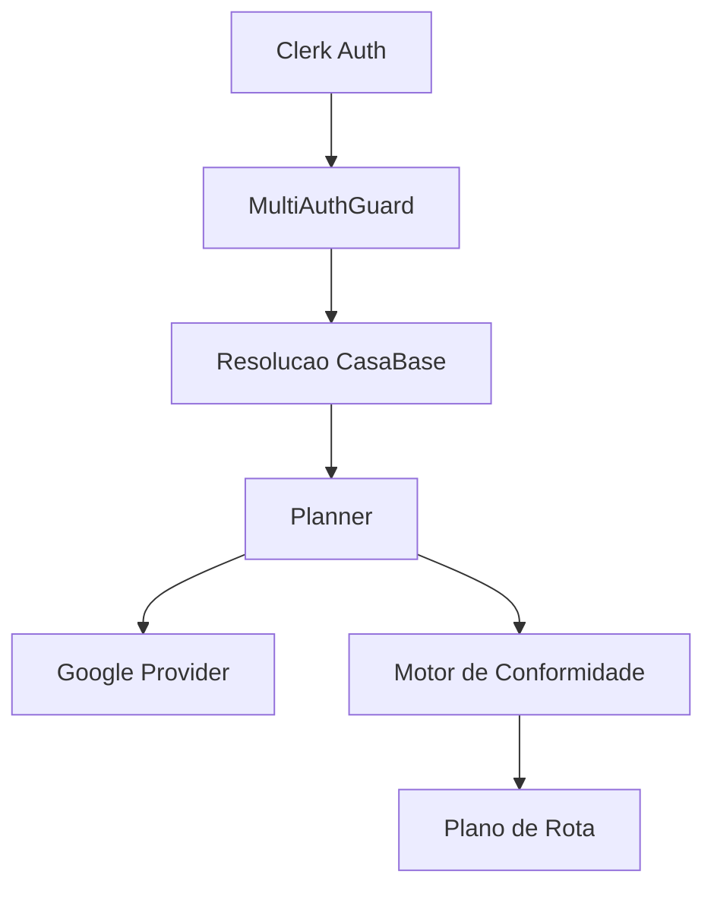

# Design Doc — Roteirização Segura Multi-Carro

## Status
Draft

## Autor
Leonardo Nascimento Cintra

## Objetivo
O módulo de roteirização tem como objetivo organizar o transporte seguro de crianças/adolescentes entre famílias.

A principal restrição do sistema é impedir qualquer trecho onde exista apenas 1 adulto e 1 única criança/adolescente no veículo,
reduzindo riscos operacionais e situações inadequadas.

O objetivo principal é encontrar a melhor rota para levar as crianças/adolescentes para suas casas.

## Escopo
Este documento define a implementação do módulo de roteirização segura multi-carro
dentro do domínio `/src/poscrisma` da API existente.

O objetivo do módulo é permitir o planejamento seguro de transporte de
crianças/adolescentes entre famílias, garantindo conformidade obrigatória
durante todos os trechos da rota.

O escopo deste MVP inclui:

- autenticação integrada ao Clerk utilizando contratos já existentes da API;
- isolamento multi-tenant baseado em CasaBase;
- fluxo de onboarding obrigatório no primeiro acesso;
- compartilhamento de dados entre TITULAR e CONJUGE via código de convite;
- cadastro de crianças/adolescentes com suporte a 1 ou 2 endereços;
- cadastro obrigatório de pelo menos 1 veículo por CasaBase;
- suporte a até 2 veículos simultâneos no planejamento;
- definição de condutores padrão (casal) e adulto temporário autorizado;
- geração de plano de rota otimizado por menor distância total;
- integração com Google Maps para cálculo de matriz de custo e ordenação de paradas;
- validação obrigatória de conformidade em todos os trechos;
- bloqueio automático de estados proibidos;
- geração de plano principal e alternativas válidas;
- auditoria de decisões do algoritmo e violações bloqueadas;
- endpoints privados de onboarding, cadastro, planejamento e execução de rota;
- testes unitários do motor de planejamento;
- testes e2e do fluxo completo de onboarding e roteirização;
- isolamento de dados entre diferentes CasaBase.

Todas as alterações deste ciclo devem permanecer restritas ao módulo
`/src/poscrisma`, sem refatoração de outros domínios da aplicação.

## Fora de Escopo
Os itens abaixo não fazem parte do MVP atual e não devem ser implementados neste ciclo:

- rastreamento em tempo real dos veículos;
- aplicativo dedicado para motoristas;
- compartilhamento de rotas entre diferentes CasaBase;
- cálculo avançado de combustível, pedágio ou custo financeiro;
- otimização baseada em trânsito em tempo real;
- replanejamento automático dinâmico durante a execução da rota;
- suporte a mais de 2 veículos por planejamento;
- integração com múltiplos provedores de mapas;
- suporte offline;
- notificações push ou comunicação em tempo real;
- histórico analítico avançado de rotas;
- inteligência artificial preditiva para planejamento;
- sugestão automática de presença/passageiros;
- dashboard operacional;
- sistema de permissões granular além dos papéis TITULAR e CONJUGE;
- internacionalização;
- multi-idioma;
- refatoração dos módulos globais existentes da API;
- alterações estruturais no fluxo atual de autenticação Clerk;
- alteração do comportamento do `MultiAuthGuard` fora das necessidades do módulo;
- migração de nomenclaturas antigas da aplicação para o novo padrão do domínio;
- sincronização entre múltiplas sessões simultâneas em tempo real.

## Contexto de Negócio
O módulo de roteirização foi concebido para organizar o transporte seguro
de crianças e adolescentes entre famílias participantes de uma mesma comunidade.

Atualmente, o planejamento das rotas ocorre de forma manual, informal e sem
controle sistemático de segurança, gerando dificuldades como:

- distribuição ineficiente de passageiros;
- excesso de viagens desnecessárias;
- falta de controle de capacidade dos veículos;
- ausência de padronização na definição de responsáveis;
- dificuldade para coordenação entre famílias;
- risco operacional durante embarque e desembarque;
- ausência de rastreabilidade das decisões tomadas.

Além do problema operacional, existe uma exigência crítica de conformidade:
o sistema nunca pode permitir situações consideradas inadequadas ou inseguras
durante qualquer trecho da rota.

A principal regra de segurança do domínio é:

- nunca permitir que exista apenas 1 adulto e 1 única criança/adolescente
  sozinhos em um veículo durante qualquer trecho da rota.

Essa restrição deve ser tratada como uma invariante obrigatória do sistema,
não podendo ser ignorada pelo algoritmo, usuário ou interface.

O domínio também exige flexibilidade operacional para refletir cenários reais
das famílias, incluindo:

- compartilhamento de acesso entre marido e esposa;
- suporte a múltiplos endereços para crianças;
- uso opcional de adulto temporário autorizado;
- utilização de até 2 veículos simultaneamente;
- reorganização de passageiros durante o trajeto;
- desembarque simultâneo de múltiplas crianças na mesma parada.

A solução proposta centraliza o planejamento no backend,
garantindo que todas as regras críticas de segurança,
isolamento multi-tenant e conformidade sejam aplicadas
de maneira consistente independentemente do frontend utilizado.

O MVP possui foco inicial em:

- segurança operacional;
- conformidade obrigatória;
- simplicidade de execução;
- menor distância total da rota;
- arquitetura extensível para futuras evoluções.

O sistema foi projetado desde o início para suportar evolução incremental,
permitindo futuramente funcionalidades como:

- rastreamento em tempo real;
- otimização dinâmica;
- inteligência preditiva;
- múltiplos provedores de roteamento;
- aplicativos dedicados para motoristas;
- observabilidade avançada;
- automações baseadas em AI.

### Regra de prevenção obrigatória

O planner deve impedir antecipadamente qualquer configuração
que possa gerar estado proibido em trechos futuros da rota.

Exemplo de cenário inválido:

- veículo possui:
  - 1 adulto
  - 2 crianças

Se uma das crianças for desembarcada,
o próximo trecho inevitavelmente resultará em:

- 1 adulto
- 1 criança

Como esse estado é proibido,
o sistema NÃO deve permitir que o veículo saia inicialmente
nessa configuração.

Nesse caso, o planner deverá obrigatoriamente:

- adicionar outro adulto ao veículo;
ou
- manter mais crianças/adolescentes no veículo;
ou
- reorganizar distribuição entre carros;
ou
- inserir retorno para casa-base antes do desembarque.

---

### Regra de continuidade segura

Crianças/adolescentes não podem ser desembarcados de forma
que o próximo trecho restante do veículo gere estado proibido.

Exemplo:

Cenário permitido:

- 2 adultos
- 2 crianças

Após desembarque da primeira criança:

- 2 adultos
- 1 criança

Estado continua válido.

Cenário proibido:

- 1 adulto
- 2 crianças

Após desembarque da primeira criança:

- 1 adulto
- 1 criança

Estado proibido.

Portanto, esse trajeto deve ser bloqueado antes mesmo
da saída inicial do veículo.

---

### Regra de validação preditiva

A validação de conformidade deve considerar:

- estado atual do veículo;
- próximos desembarques;
- sequência futura das paradas;
- composição restante do carro após cada parada.

O planner não deve validar apenas o estado atual,
mas também todos os estados futuros possíveis da rota.

## Arquitetura
O módulo será implementado integralmente dentro de:

`/src/poscrisma`

Arquitetura baseada em:
- NestJS
- Prisma
- PostgreSQL
- arquitetura modular
- services desacoplados
- provider pattern
- planejamento determinístico

Componentes principais:

## Fluxo de Onboarding

## Modelo Multi-Tenant

## Modelagem de Domínio

## Estratégia de Planejamento de Rotas

## Fluxo de Planejamento

## Estratégia Multi-Carro

## Regras de Conformidade

## Integração Google Maps

## Estrutura de Pastas

## Contratos e Convenções

## Estratégia de Persistência

## Estratégia de Observabilidade

## Estratégia de Falhas

## Estratégia de Testes

## Riscos Técnicos

## Decisões Arquiteturais

## Roadmap Futuro

## ADR Relacionadas